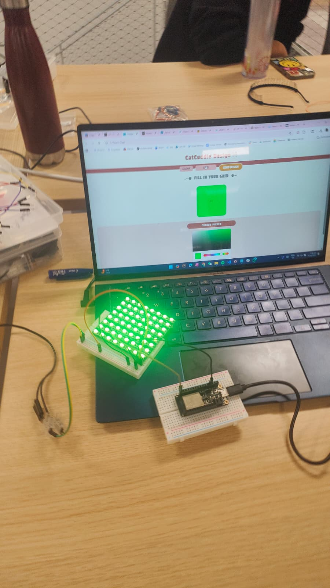
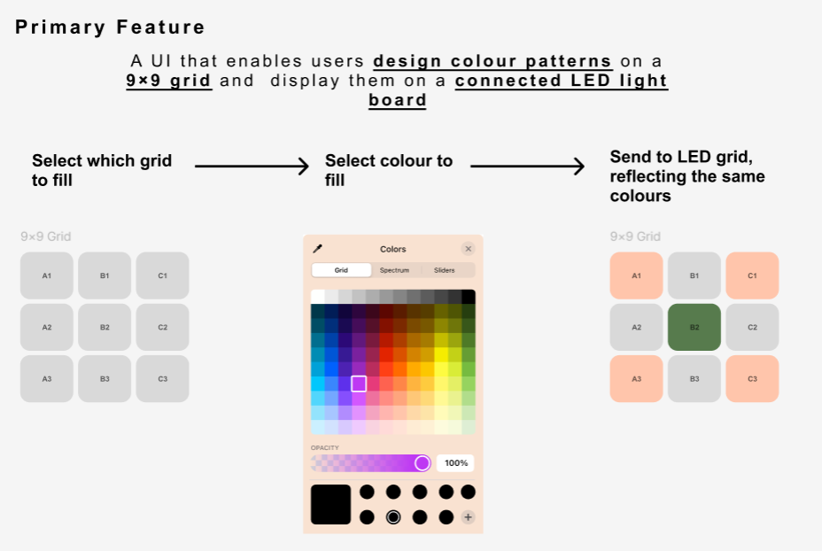

# My Submission: CatCuddles
In this repo you will find my final fabulously well-documented submission of my project "CatCuddles", a web application design for crafty people (comme moi!) that want to create a colourful design and have it displayed through a visual LED lights (henceforth utlising a NeoMatrix 8*8). 
Although this project didn't turn out as what I had envisioned at the start, and it was also quite a process to create the link between Arduino, AdafruitIO and the Website itself. It was overall a fruitful project with many many takeaways. 

## CWIOT
1.The complete code for my project is organised within a dedicated folder named CWIOT. 

Under this folder you will find my Coding for Arduino in 2 files, 1 for Huzzah32 and 1 for the Config ( to establish the connection with the hotspot). 

### Schematic View
A schematic view of my project’s circuit involving 3 main elements, the Adafruit NeoPixel 8*8, the Huzzah32, and a connection the electricty (to power the LED lights).

### Photographs 
--> Here you will find a stunning photograph of my beautiful completed AND functioning project 

### Video
--> Here you will find the youtube video with the live demo for the web/ mobile application 

### DWW
***Please note for best form of viewing the application please place the website view in width=412, and keep the same height ( so it can be viewed in the form of a mobile phone screen) 

#### Moodboard
--> Here you will find the original inspo behind "CatCuddles", and how it lead to the creative amazingness work of Picasso it is now.  

#### User flow 
--> Here is the userflow. Period. 

[See the user flow in figma↗](https://www.figma.com/design/zsRW52l56JcvCLIkMKmUMS/Nichola_Prototype?node-id=26-95&t=z6wLBWpUHZll1aZ0-1))

Thank you for your time and viewing and hope the coding makes sense :)
